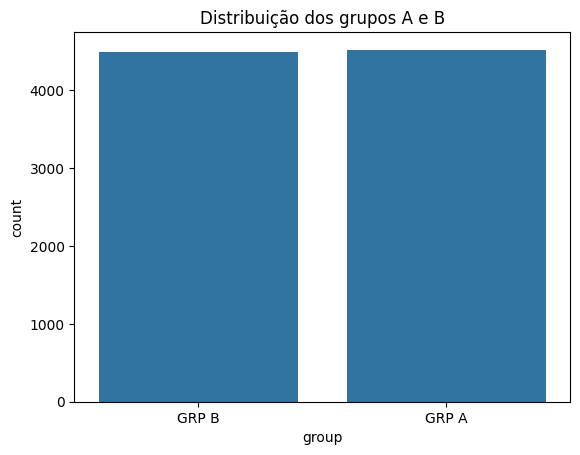
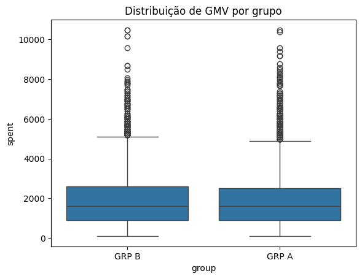
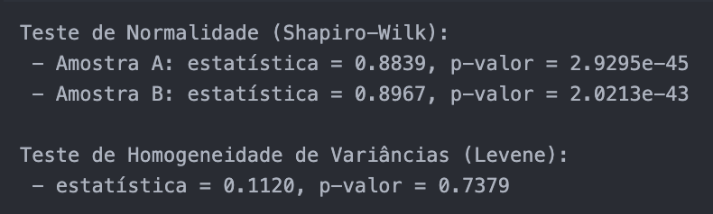
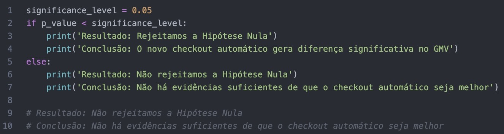

# A/B Teste: Checkout Automático vs Manual  
**Empresa fictícia: Eletronic House**

Este projeto simula a análise de um experimento A/B realizado para avaliar o impacto de um novo sistema de **preenchimento automático dos dados de cartão de crédito** no comportamento de compra dos usuários, com foco na métrica de **GMV (Gross Merchandise Volume)**.

## Objetivo

Investigar se a implementação de um preenchimento automático dos dados de cartão no checkout aumenta significativamente a receita média por usuário (GMV), em comparação ao modelo tradicional de preenchimento manual.

## Descrição do Experimento

- **Grupo A (Tratamento)**: Página de checkout com preenchimento automático dos dados do cartão.
- **Grupo B (Controle)**: Página de checkout com preenchimento manual dos dados do cartão.
- **Duração**: Período X (não especificado).
- **Localidade**: Apenas usuários do Brasil foram analisados neste projeto.

## Metodologia

### 1. Preparação dos Dados
- Leitura do dataset em `.csv`.
- Conversão de colunas de data.
- Filtragem dos dados para incluir apenas usuários do Brasil.
- Verificação de valores ausentes e unicidade dos identificadores de usuário (`uid`).
- Análise do balanceamento entre os grupos.

### 2. Análise Exploratória (EDA)
- Distribuição dos usuários por grupo experimental.
  

- Análise gráfica da dispersão do gasto (`spent`) por grupo.

  
- Cálculo de estatísticas descritivas para `spent` e `purchases`.

|        | uid             | spent          | purchases      |
|----------------|------------------|----------------|----------------|
| count          | 9.009            | 9009.000       | 9009.000       | 
| mean           | 55.722.870       | 1902.86        | 4.58           |
| min            | 11.143.140       | 99.00          | 1.00           |
| 25%            | 33.428.110       | 897.00         | 2.00           |
| 50% (mediana)  | 55.869.560       | 1596.00        | 4.00           | 
| 75%            | 78.131.060       | 2593.00        | 6.00           | 
| max            | 99.996.990       | 10,480.00      | 24.00          | 
| std (desvio)   | 25.669.810       | 1398.89        | 3.15           | 

### 3. Formulação das Hipóteses

- **H₀ (Hipótese Nula)**: O GMV médio do grupo A é igual ao GMV médio do grupo B.
- **H₁ (Hipótese Alternativa)**: O GMV médio dos grupos é diferente.

#### Por que usar H₀ e não H₁ como ponto de partida?

Por padrão, assumi que **não existe efeito/diferença** até que existam evidências estatísticas para provar o contrário.  
Rejeito H₀ apenas quando há forte evidência de que H₁ é verdadeira.

#### O que significa **não rejeitar H₀**?

Significa que **os dados não forneceram evidência estatisticamente significativa** para concluir que o preenchimento automático é melhor ou pior que o manual.

**Importante:**  
Não rejeitar H₀ **não significa que H₀ é verdadeira** — apenas que, com os dados disponíveis, não foi possível provar o contrário.

### 4. Cálculo do Tamanho de Amostra

- Efeito esperado: 5% de aumento no GMV.
- Fórmula baseada no teste t para duas amostras independentes.
- Nível de significância: 0.05
- Poder estatístico: 80%

### 5. Inferência Estatística

- Teste de normalidade (Shapiro-Wilk)
- Teste de homogeneidade de variâncias (Levene)
- Teste t bilateral para duas amostras independentes

  

## Resultados

- **p-valor**: O valor encontrado de p-valor: 0.7191302924096752. Acima de 0.05 (não significativo)
- **Conclusão**: Falha em rejeitar H₀ — não há evidências estatísticas de que o checkout automático aumente o GMV.

  

## Limitações

- Apenas usuários do Brasil foram analisados.
- GMV é apenas uma das métricas possíveis (não considera taxa de conversão, abandono, etc).

## Tecnologias Utilizadas

| Ferramenta     | Finalidade                           |
|----------------|--------------------------------------|
| Python         | Linguagem principal                  |
| Pandas         | Manipulação de dados                 |
| NumPy          | Estatísticas                         |
| Matplotlib / Seaborn | Visualizações                  |
| Statsmodels    | Cálculo do tamanho amostral          |
| SciPy          | Testes estatísticos (t, Shapiro, Levene) |
| Pingouin       | Estatísticas adicionais              |

## Autor

Este projeto foi desenvolvido por Raphael Pimentel com foco em experimentação e inferência estatística.  
[🔗 LinkedIn](https://www.linkedin.com/in/raphaelcmpimentel/)
